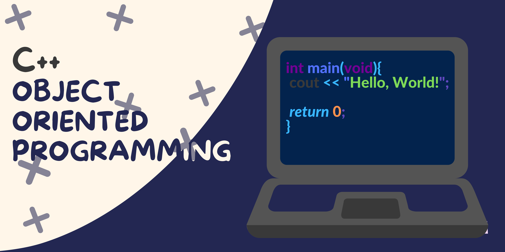

 


# C++ Programming Language

This is simple documentation on c++ programming language for me. I create this documentation on my way and I also use g++ compiler for learn c++. Also I can not write whole basic document in here. Because I already learn them in c.Just I write basic thing which is different from c.



## Table of Content

- [Basic](#Basic)
  - [Basic Builtin Function](#Basic-Builtin-Function)
  - [Commenting](#Commenting)
  - [Type Casting](#Type_Casting)
  - [Function and C++](#Function_and_C++)
    - [Default_Arguments](#Default_Arguments)
    - [Function Perameter Pointer Refercence](#Function_Perameter_Pointer_Refercence)
  - [Void Pointer](#Void_Pointer)
  - [Structure Union and Enum](#Structure_Union_and_Enum)
  - [References](#References)
    - [Const References](#Const_References)
    - [Reference as Return](#Reference_as_Return)
- [Classes](#Classes)
  - [Object](#Object)
  - [Member Variable](#member_variable)
  - [Member Function](#member_function)
  - [Access Specfier](#access_specfier)
    - [public](#public)
    - [private](#private)
  - [Constructor](#Constructor)
  - [Destructor](#Destructor)
  - [Static Member](#Static_Member)
  - [Static Member Function](#Static_Member_function)
  - [Friend](#Friend)
    - [Friend Member Function](#Friend_Member_Function)
    - [Stand Alone Function Friend](#Stand_Alone_Function)
  - [Const Member Function](#Const_Member_Function)
- [Object](#Object)
  - [Copy Object](#Copy_Object)
  - [Copy Constructor](#Copy_Constructor)
  - [Object and Function](#Object_and_Function)
  - [Object Array](#Object_Array)
  - [this_keyword](#this_keyword)
- [Dynamic Memory](#Dynamic_Memory)
- [Inheritance](#Inheritance)
- [Polymorphism](#Polymorphism)
  - [function overloading](#function_overloading)
  - [overload_constructor_and_member](#overload_constructor_and_member)
  - [operator overloading](#operator_overloading)
  - [operator function as friend](#operator_function_as_friend)
  - [overload insertion operator](#overload_insertion_operator)
  - [overload bracket operator](#overload_braket_operator)
- [Virtual Function](#Virtual_Function)
  - [Override](#Override)

# Basic

Let see basic program on c.

**_Program: print_hello_world :_**

```cpp
#include <iostream>
using namespace std;

int main(void){
    cout << "Hello, World!" << endl;

    return 0;
}
```

**_Output :_**

```
Hello, World!
```

**_Another Program: print_Hey_Universe :_**

```cpp
#include <iostream>
using namespace std;

int main(void){
    cout << "Hey, Universe!\n";
    return 0;
}
```

**_Output :_**

```
Hey, Universe!
```

This is the basic c++ program structure. C++ is the super set of c programming language. So in that case all syntax in c work in c++ well allmost all. C++ also case sensitive langauge.

## Basic-Builtin-Function

Some basic built in function on c++;

| Function | Work           |
| -------- | -------------- |
| cout     | see the output |
| cin      | take the input |
| endl     | get line break |

### cout

cout full form is **character output.**

**_Program : cout_**

```cpp
#include <iostream>
using namespace std;

int main(void){
    cout << "Hey, Universe!\n"; // show output
    return 0;
}
```

**_Program : cin_**
cin full form **character intput.**

```cpp
#include <iostream>

using namespace std;

int main(void){
    int number;

    cin >> number; // get the number

    cout << "Number is " << number << "\n";
    return 0;
}
```

**_Output :_**

```
45
Number is 45
```

### endl

endl full form is **end line.**

**_Program : endl_**

```cpp
#include <iostream>
using namespace  std;

int main(void){
    cout << "Hello, World!" << endl; // take line break here
    return 0;
}
```

## Commenting

Commenting in c++ like in c.

**_Program : comment_**

```cpp
# include <iostream>

using namespace std;

int main(void){
    // this is single ine of comment

    /**
     * This is multiline of comment
     *
     * */

    return 0;
}
```

## Type_Casting

Type casting in c++ like in c. But can typecasting another way.

**_Program : typecasting_**

```cpp
#include <iostream>

using namespace std;

int main(void){
    int x,y;
    x = 20;
    y = 20;

    // type cating way in c
    double double_x = (double) x + 0.32;
    double double_y = double(y) + 0.32;

    // print the double_x and double_y
    cout << "double_x = " << double_x << endl;
    cout << "double_y = " << double_y << endl;
    return 0;
}
```

**_Output : typecasting_**

```
double_x = 20.32
double_y = 20.32
```

## Function_and_C++

In c++ funciton like in c. But in c++ function have extra feature.

### Default_Arguments

We can set default argument in c++ funciton.

**_Program : Default Arguments_**

```cpp
#include <iostream>

using namespace std;

// function prototype
void print_value(
    int x = 55, /* default value */
    int y = 99 /* default value */
    );
/**
 * default value must declear in
 * function prototype
 *
 * */

int main(void){
    print_value(30,40);
    print_value();
    return 0;
}

// print_value function
void print_value(int x,int y){
    cout << "x = " << x << endl;
    cout << "y = " << y << endl;
    cout << "\n" << endl;
}
```

**_Output : Default Arguments_**

```
x = 30
y = 40


x = 55
y = 99


```

### Function_Perameter_Pointer_Refercence

We can use pointing refercening in function perameter in c++.

**_Program : perameter pointer reference_**

```cpp
#include <iostream>

using namespace std;

// function prototype
void swap_value(int &,int &);

int main(void){
    int x,y;
    x = 30;
    y = 100;

    cout << "Before Swaping" << endl;
    cout << "x = " << x << endl;
    cout << "y = " << y << endl;

    swap_value(x,y);
    cout << "After Swaping" << endl;
    cout << "x = " << x << endl;
    cout << "y = " << y << endl;
    return 0;
}

// swap_value function
void swap_value(int &x,int &y){
    int temp = y;
    y = x;
    x = temp;
}
```

**_Output : perameter pointer reference_**

```
Before Swaping
x = 30
y = 100
After Swaping
x = 100
y = 30
```

## Void_Pointer

C++ can not set pointer variable value directly.

**_Porgram : void_pointer_**

```cpp
#include <iostream>

using namespace std;

int main(void){
    void *ptr_void;
    int *ptr_int;
    int x = 20;
    ptr_void = &x;

    // we can not do that in c++
    // ptr_int = ptr_void;

    // instead do that
    ptr_int = (int *) ptr_void;

    cout << "*ptr_int = " << *ptr_int << endl;


    return 0;
}
```

**_Output : void_pointer_**

```
*ptr_int = 20
```

## Structure_Union_and_Enum

we can use structure, union and enum like in c.But extra benifit is declear a theis type of variable without using theis keyword.

**_Program : Structure_Union_and Enum_**

```cpp
#include <iostream>

using namespace std;

// create custom datatype
enum Day {
    fri,sat,sun,mon,tue,wed,thu
};

struct Create_Date{
    int year;
    int month;
    Day day;
};

union Day_Cost{
    int eid_day;
    int eid_cost;
};

int main(void){
    Create_Date to_day;
    to_day.year = 2022;
    to_day.month = 1;
    to_day.day = sat;

    Day_Cost last_eid;
    last_eid.eid_cost = 300;

    cout << "Today = " << to_day.year << "/" << to_day.month << "/" << to_day.day << endl;
    cout << "last Eid Cost = " << last_eid.eid_cost << endl;

    return 0;
}
```

**_Output : structure union and enum_**

```
Today = 2022/1/1
last Eid Cost = 300
```

## References

This is the different feature in c++ from c. It is one kind of variable which act like a normal and pointer variable

**_Rule of declear references :_**

```
data_type& reference_name = variable_of_data_type
```

**_Program : References_**

```cpp
#include <iostream>

using namespace std;

int main(void){
    int x = 90;

    // declear reference
    int &r_x = x;

    cout << "r_x = " << r_x << endl;

    cout << "After change value by refercence" << endl;
    r_x = 300;
    cout << "x = " << x << endl;
    return 0;
}
```

**_Output : References_**

```
r_x = 90
After change value by refercence
x = 300
```

### Const_References

we can use const reference in c++.

**_Program : const references_**

```cpp
#include <iostream>

using namespace std;

int main(void){
    int x = 30;

    // declear const reference
    const int & cr_x = x;

    // can not do that
    // cr_x = 33;

    // but we can change x value by x
    cout << "cr_x = " << cr_x << endl;
    cout << "changing value by x" << endl;
    x = 0;
    cout << "cr_x = " << cr_x << endl;

    return 0;
}
```

**_Output : const references_**

```
cr_x = 30
changing value by x
cr_x = 0
```

### Reference_as_Return

we can use reference as return type of function.

**_Program : reference as return_**

```cpp
#include <iostream>

using namespace std;

int x = 20;

// function prototype
int & return_r(void){
    return x;
}

int main(void){
    cout << "x Before Change" << endl;
    cout << "x = " << x << endl;

    return_r() = 403;

    cout << "after change" << endl;
    cout << "x = " << x << endl;
    return 0;
}
```

**_Output : reference as return_**

```
x Before Change
x = 20
after change
x = 403
```

# Classes

In c++ class call core of c++.Class Create Object.Object is instance of class.

**_Basic Class Structure :_**

```
class <class_name>{
    private :
        private_member_variable(s);
        private_member_function(s)();
    public :
        public_member_variable(s);
        public_member_functions(s)();
    protected :
        protected_member_variable(s);
        protected_meber_function(s)();
}
```

**_Program : example class_**

```cpp
#include <iostream>
#include <string.h>

using namespace std;

// create class
class Person{
    private :
    int height;
    int age;

    public :
    Person(char _name[],int _age,int _height){
        strcpy(name,_name);
        age = _age;
        height = _height;
    }
    char name[30];
    int get_height(void){
        return height;
    }
    int get_age(void){
        return age;
    }
    void set_age_and_height(int _age,int _height){
        age = _age;
        height = _height;
    }

};

int main(void){
    Person tazri("Md Tazri",17,5.1);

    cout << ">>> Print Details About Tazri <<<" << endl;
    cout << "Name   : " << tazri.name << endl;
    cout << "Age    : " << tazri.get_age() << endl;
    cout << "Height : " << tazri.get_height() << endl;

    return 0;
}
```

**_Output : example class_**

```
>>> Print Details About Tazri <<<
Name   : Md Tazri
Age    : 17
Height : 5
```

## Object

Object create by class. It one kind of physical representation.

**_Create Object :_**

```
Class_Name <object_name>(construction,parameter);
```

## Member_variable

Any kind of data mean object attributes can store in member variable in class. Any kind of built-in datatype variable like array, pointer, structure, enum even class can store as a member variable.

**_Member Variable :_**

```
class class_name{
    private :
        private_member_variable;

    protected :
        protected_member_variable;

    public :
        public_member_variable;

}
```

**_Program : Member Variable _**

```cpp
#include <iostream>

using namespace std;

// simple class
class Person{
    public :
        int age,roll,height;
};

int main(void){
    Person tazri;

    // print tazri object before define variable
    cout << ">>> Before Define Value <<<" << endl;
    cout << "Age : " << tazri.age << endl;
    cout << "Roll : " << tazri.roll << endl;
    cout << "Height : " << tazri.height << endl;

    tazri.age = 17;
    tazri.roll = 35;
    tazri.height = 5.1;

    // print tazri object after define value
    cout << ">>> After Define Value <<<" << endl;
    cout << "Age : " << tazri.age << endl;
    cout << "Roll : " << tazri.roll << endl;
    cout << "Height : " << tazri.height << endl;

    return 0;
}
```

**_Output : member variable_**

```
>>> Before Define Value <<<
Age : 32765
Roll : 0
Height : 0
>>> After Define Value <<<
Age : 17
Roll : 35
Height : 5
```

## Member Function

Member function is behavior of object. Example of Member function.

```
class class_name{
    private :
        private_member_function();
    protected :
        protected_member_function();
    public :
        public_member_function();
}
```

**_We can write defination of member function in two way._**

- inside the class which call inline function.
- outside the class.

**_Define inline function rule_**

```
class class_name{
    public :
    data_type function_name(perameter_list){
        defination of the funciton........
    }
}
```

**_Define member function outside the class_**

```
class class_name{
    public :
    return_data_type function_name(perameter_list);
}

// write defination function outside the class
return_data_type class_name::member_funciton_name(perameter_list){
    function defination.....................
}
```

**_Program : member function_**

```cpp
#include <iostream>

using namespace std;

// create simple class
class Person{
    private :
    int age,roll,height,weight;
    public :
    int get_age(void){ // inline function
        return age;
    };
    void set_age(int _age);
};

// define set_age function outside the class
void Person::set_age(int _age){
    age = _age;
}

int main(void){
    // create object
    Person tazri;

    tazri.set_age(17);
    cout << "Age : " << tazri.get_age() << endl;
    return 0;
}
```

**_Output : member function_**

```
function
Age : 17
```

**_More Important thing about member function_**

- Inline function is little more faster then outside function defination. But it consume the storage.

- Outside defination function is slower then inline function but it save the storage.

- :: it call scope resolution operator.
- we can call member function inside the another member function in same class without . operator.

## Access_Spacfier

Access spacfier define which variable can use outside the class. Two access apacifier is :

- Public (keyword's public)
- Private (keyword's private)

### Pubilc

If declear memeber inside the public that can access outside the function.

**_Declear a member inside the public :_**

```cpp
class name{
    public : // access spacfier keyword's
        int member_variable; // memeber variable
        int memeber_function; // memeber function
}
```

**_Program : public_**

```cpp
#include <iostream>

using namespace std;

// create class
class Person{
    public :
        int age,height,weight;
    public :
        int account;
        void show_info(void){
            cout << ">>> Details <<<" << endl;
            cout << "> Age : " << age << endl;
            cout << "> Height : " << height << endl;
            cout << "> Weight : " << weight << endl;
        }
};

int main(void){
    // create object
    Person tazri;

    // access the member function
    tazri.age = 17;
    tazri.height = 5;
    tazri.weight = 45;
    tazri.account = 0;

    // access the public function
    tazri.show_info();
    cout << "> Balance : " << tazri.account << endl;

    return 0;
}
```

**_Output : public_**

```
>>> Details <<<
> Age : 17
> Height : 5
> Weight : 45
> Balance : 0
```

We can use public keyword mulitiple time inside the class as well.

### private

Private spacfier is define that memeber variable can not use outside the function.

**_Declear private memeber_**

```cpp
class class_name{
    int private_memeber;
    int private_function();

    private :
        int private_memeber;
        int private_function();
}
```

If you declear function or variable inside the class without any access spacfier keyword then comiplear take this as a private member.

**_Program : private_**

```cpp
#include <iostream>

using namespace std;

// create class
class Person{
    // creating private memeber without private keyword
    int age;
    void print_hello(void);

    // creating private memeber with private keyword
    private :
        int height;

    public :
        void set_age_height(int,int);
        void print_details(void);

};

// print_hello function
void Person::print_hello(void){
    cout << "Hello, World!" << endl;
}

// set_age_height funciton
void Person::set_age_height(int _age,int _height){
    age = _age;
    height = _height;
}

// print_details function
void Person::print_details(void){
    cout << ">>> Details <<<" << endl;
    cout << "> Age : " << age << endl;
    cout << "> Height : " << height << endl;
    print_hello();
}

int main(void){
    // create person
    Person p_one;
    p_one.set_age_height(17,5);

    // this line will get error
    // p_one.print_hello();

    p_one.print_details();

    return 0;
}
```

**_Output : private_**

```
>>> Details <<<
> Age : 17
> Height : 5
Hello, World!
```

Private member only can use inside the public member function.

## Constructor

Constructor is default class function which added by compiler. It called when object is create.

**_Rule for declear constructor function_**

1. It declear must be inside public. Because it called outside the class.
1. The constructor function name must be same with class name.
1. Constructor function can not return anything.

**_Declear constructor function_**

```
class Class_Name{
    public :
        Class_Name(perameter_list){
            function defination
            -------------------
            -------------------
        }
};
```

**_Ohter way to declear constructor function_**

```
class Class_Name{
    public :
        Class_Name(peramter_list); // prototype
}

Class_Name::Class_Name(peramer_list){
    function defination
    -------------------
    -------------------
}
```

**_Program : constructor_**

```cpp
#include <iostream>

using namespace std;

// one way to declear constructor
// class Pointer{
//     int x,y;
//     public :
//         Pointer(int _x,int _y){
//             x = _x;
//             y = _y;
//         };

//         void print(void){
//             cout << ">>> Poitner <<<" << endl;
//             cout << "> x : " << x << endl;
//             cout << "> y : " << y << endl;
//         }
// };

// another way to declear constructor
class Pointer{
    int x,y;

    public :
        Pointer(int,int);
        void print(void);
};

// constructor function
Pointer::Pointer(int _x,int _y){
    x = _x;
    y = _y;
}

// print function
void Pointer::print(void){
    cout << ">>> Pointer Details <<<" << endl;
    cout << "> x : " << x << endl;
    cout << "> y : " << y << endl;
}

// main function
int main(void){
    // create pointer
    Pointer position(45,78);
    position.print();
    return 0;
}
```

**_Output : constructor_**

```
>>> Pointer Details <<<
> x : 45
> y : 78
```

## Destructor

Destructor is another default function of class which added by comipler by default. It called when the object is erase in storage.

**_Rule to declear Destructor_**

1. Destructor function name must be same with class name starting with ~ symbol
1. It's must declear inside the public.
1. It's can not reaturn anything and it can not get any perameter.

**_Declear Destructor_**

```
class Class_Name{
    public :
        ~Class_Name(){
            /**
            * This is destructor function
            * defination.
            *
            */
        };
};

// another way to declear destructor
Class_Name::~Class_Name(){
    /**
    * This is destructor function
    * defination
    *
    */
}
```

**_Program : Destructor_**

```cpp
#include <iostream>

using namespace std;

// declear destructor
// class Sample{
//     public:
//         Sample(void){
//             cout << "Object created" << endl;
//         };
//         ~Sample(void){
//             cout << "Object Deleted" << endl;
//         };
// };

// another way to declear destructor
class Sample{
    public :
        Sample(void);
        ~Sample();
};

// declear constructor
Sample::Sample(void){
    cout << "Object was created" << endl;
};

Sample::~Sample(){
    cout << "Object was Deleted" << endl;
}

int main(void){

    {
        // create object
        Sample object;
    }

    return 0;
}
```

**_Output : destructor_**

```
Object was created
Object was Deleted
```

## Static_Member

Static member is one kind of variable wich address share by every object. Every object can access it. Static member can be private or public.

**_Creating Static Member_**

```cpp
class Name{
    // declear private static member
    static data_type x,y;

    public :
        // declear public static member
        static int p,z;
};

// define the static memeber
data_type Name::x;
data_type Name::y;
data_type Name::p;
data_type Name::z;

```

**_Program : Static Member_**

```cpp
#include <iostream>

using namespace std;

// create class
class Pointer{
    // create private member
    int x,y;
    // create static variable
    static int total_point;

    // create public member
    public :
        Pointer(int _x = 0,int _y = 0);
        ~Pointer(void);
        void print_total_point(void);
        void set_pointer(int,int);
        void print(void);

};

// define static member
int Pointer::total_point = 0;

// define constructor
Pointer::Pointer(int _x,int _y){
    Pointer::x = _x;
    Pointer::y = _y;
    Pointer::total_point++;
}

// define destructor
Pointer::~Pointer(){
    Pointer::total_point--;
}

void Pointer::print_total_point(void){
    cout << "Total Point : " << total_point << endl;
}

void Pointer::set_pointer(int _x,int _y){
    Pointer::x = _x;
    Pointer::y = _y;
}

void Pointer::print(void){
    cout << ">>> Detail <<<" << endl;
    cout << "X : " << x << endl;
    cout << "Y : " << y << endl;
}

int main(void){
    // create 5 pointer
    Pointer p_one,p_two,p_three,p_four,p_five;

    p_one.print_total_point();
}
```

**_Output :_**

```
Total Point : 5
```

## Static_Member_Function

It look like static member variable. Different is it is function which can access every object of same class. But we can call this function with scope resolution operator. Same thing we do with static variable.

**_Creating static member function_**

```cpp
class  name{
    public :
        static int number;
        static void print_number(void){
            --------------------------
            function defination
        }
}
```

**_Program : static member function_**

```
#include <iostream>

using namespace std;

// creating class
class Sample{
    public :
        static int number;

        // define static function member
        static void print_number(void);
        static void hello(void){
            cout << "Hello, World!" << endl;
        }
};

// define static variable member
int Sample::number;

// define static function member
void Sample::print_number(void){
    cout << "Number : " << number << endl;
}


int main(void){
    Sample::number = 300;
    Sample::hello();
    Sample::print_number();
}
```

**_Output : static member function_**

```
Hello, World!
Number : 300
```

## Friend

Friend this concept in c++ use for to give permission the member function to use another class private member.

**_Use the member function_**

```c++
class Class_A{
    int a,b;
    public :
        friend class Class_B;
}

// another way
// forward reference
class Class_B;

class Class_A{
    int a,b;
    public :
     friend Class_B;
}
```

Now here Class_B's memeber function's can use Class_A's private memeber. Let's going to see example:

**_Program : friend_**

```cpp
#include <iostream>

using namespace std;

// creating class

// class_A class
class Class_A{
    int a,b;
    public :
        Class_A(int _a = 0,int _b = 0);
        friend class Class_B;
};

// Class_A constructor
Class_A::Class_A(int _a,int _b){
    a = _a;
    b = _b;
}

// Class_B class
class Class_B{
    public :
        void show_value(Class_A & _a);
};

// show_value
void Class_B::show_value(Class_A & _a){
    cout << ">>> Details <<<" << endl;
    cout << "A : " << _a.a << endl;
    cout << "B : " << _a.b << endl;
}

int main(void){
    // create a_object
    Class_A a_object(30,50);
    Class_B b_object;

    b_object.show_value(a_object);
    return 0;
}
```

**_Output : friend_**

```
>>> Details <<<
A : 30
B : 50
```

But we can do it another way. Forward referencing way :

**_Program : friend forward referencing_**

```cpp
#include <iostream>

using namespace std;

// creating class

// // Class_A class
// class Class_A{
//     int a,b;
//     public :
//         Class_A(int _a = 0,int _b = 0);
//         friend class Class_B;
// };

// forward referencing
class Class_B;

// Class_A class
class Class_A{
    int a,b;
    public :
        Class_A(int _a= 0,int _b = 0);
        friend Class_B;
};

// Class_A constructor
Class_A::Class_A(int _a,int _b){
    a = _a;
    b = _b;
}

// Class_B class
class Class_B{
    public :
        void show_value(Class_A & _a);
};

// show_value
void Class_B::show_value(Class_A & _a){
    cout << ">>> Details <<<" << endl;
    cout << "A : " << _a.a << endl;
    cout << "B : " << _a.b << endl;
}

int main(void){
    // create a_object
    Class_A a_object(30,50);
    Class_B b_object;

    b_object.show_value(a_object);
    return 0;
}
```

**_Output : friend forward referencing_**

```
>>> Details <<<
A : 30
B : 50
```

It's work same. But in that case we don't need to use class keyword after friend keyword.In here B is friend A class.

**_One-Way Ticket_**

In here Class_B member function can use private member of Class_A. But Class_A can not use private member of Class_B.If in that case we must friend Class_A inside the Class_B. It call two way Ticket.

**_Program : two-way ticket_**

```cpp
#include <iostream>

using namespace std;

// create first forwarding reference
class Position_a;
class Position_b;

// create Position_a
class Position_a{
    int x,y;

    public :
        Position_a(int _x = 0,int _y = 0);
        void show_value(Position_b &);
        friend Position_b;
};

Position_a::Position_a(int _x,int _y){
    x = _x;
    y = _y;
}

// create Position_b
class Position_b{
    int x,y;

    public :
        Position_b(int _x = 0,int _y = 0);
        void show_value(Position_a &);
        friend Position_a;
};

Position_b::Position_b(int _x,int _y){
    x = _x;
    y = _y;
}

// declear show_value here

void Position_a::show_value(Position_b &  _b){
    cout << ">>> Details(b) <<<" << endl;
    cout << "> x : " << _b.x << endl;
    cout << "> y : " << _b.y << endl;
}

void Position_b::show_value(Position_a & _a){
    cout << ">>> Details(a) <<<" << endl;
    cout << "> x : " << _a.x << endl;
    cout << "> y : " << _a.y << endl;
}

int main(void){
    Position_a point_a(11,22);
    Position_b point_b(88,99);

    point_a.show_value(point_b);
    point_b.show_value(point_a);

    return 0;
}
```

**_Output : two_way ticket_**

```
>>> Details(b) <<<
> x : 88
> y : 99
>>> Details(a) <<<
> x : 11
> y : 22
```

### Friend_Function

we can give permision just only one member function to use another class private member.

**_Rule to create member function_**

1. Create forward reference of function which class private member used. Think it A.
1. Then create class which class member function use. Think it B.
1. Don't write inline defination of function which use private member of another class.
1. Then write prototype of function which use private member of another function with friend keyword.
1. Then write the function defination out of the class.

**_Rule of create member function_**

```cpp
// forward referencing
class Class_A;

class Class_B{
    public :
        // don't write inline defination
        void show_value(Class_A);
};

class Class_A{
    int private_data;

    public :
        friend void Class_B::show_value(Class_A);
};

// now write show_value function
void Class_B::show_value(Class_A _a){
    /**
     * defination of function
     *
     * */
}

// now show is friend function of Class_A
```

**_Program : friend function_**

```cpp
#include <iostream>

using namespace std;

// create class
class Position_A;

// Class_B Function
class Temp{
    public :
    // don't write inline defination
    void show_value(Position_A);
};


class Position_A{
    int x,y;
    public :
        Position_A(int _x = 0,int _y = 0);
        friend void Temp::show_value(Position_A);
};

// Position constructor
Position_A::Position_A(int _x,int _y){
    x = _x;
    y = _y;
}


// create show_value function
void Temp::show_value(Position_A _a){
    cout << ">>> Position <<<" << endl;
    cout << "> X : " << _a.x << endl;
    cout << "> Y :" << _a.y << endl;
}

int main(void){
    // create Position
    Position_A p(33,99);
    Temp temp;

    // show value
    temp.show_value(p);
    return 0;
}
```

**_Output : friend function_**

```
>>> Position <<<
> X : 33
> Y :99
```

### Stand_Alone_Function_Friend

we can use stand alone function as a friend.

**_Rule to create stand alone function as a friend_**

```cpp
// create forward referencing
class Position;
void show_value(Position);

class Position{
    int x,y;
    public :
        Positon(int _x = 0,int _y = 0);
}

Position::Position(int _x,int _y){
    x = _x;
    y = _y;
}

void show_value(Position a){
    // we can access private data of Position Class
}
```

**_Program : Stand Alone Function Friend_**

```cpp
#include <iostream>

using namespace std;

// forward referencing
class Position;
void show_value(Position);

// create class
class Position{
    int x,y;
    public :
        Position(int _x = 0,int _y = 0);
        friend void show_value(Position);
};

Position::Position(int _x,int _y){
    x = _x;
    y = _y;
}

// write defination of show_value function
void show_value(Position _a){
    cout << ">> Position <<" << endl;
    cout << "> x : " << _a.x << endl;
    cout << "> y : " << _a.y << endl;
}

int main(void){
    // create function
    Position p(33,99);

    show_value(p);
    return 0;
}
```

**_Output : stand alone function friend_**

```
>> Position <<
> x : 33
> y : 99
```

## Const_Member_Function

Const member function is function who can not change private data of class.

**_Create Const member function_**

```cpp
class class_name{
    public :
        // inline defination
        return_type function(perameter) const{
            defination;
        };

        // prototype
        return_type function(perameter) const;
}

// out of defination
return_type class_name::function const{
    -------------------
    defination --------
    -------------------
    -------------------
    ------- defination-
}
```

**_Program : Const Member Function_**

```cpp
#include <iostream>

using namespace std;

// create class
class Position{
    int x,y;
    public :
        Position(int _x = 0, int _y = 0);

        // create two const function
        void show_x(void) const{
            cout << "> x : " << x << endl;
        }

        void show_y(void) const;

        void change_x(int _x) const{
            // can not possible
            // x = _x;
        }

};

// create constructor
Position::Position(int _x,int _y){
    x = _x;
    y = _y;
}

void Position::show_y(void) const{
    cout << "> y : " << y << endl;
}


int main(void){
    // create postion variable
    Position p(33,99);

    cout << ">>> Position <<<" << endl;
    p.show_x();
    p.show_y();
    return 0;
}
```

**_Output : const member function_**

```
>>> Position <<<
> x : 33
> y : 99
```

# Object

In c++ class type variable called object. Let's see the example :

```cpp
class_name object_name;
```

### Rule of decleare object;

```cpp
class_name object_name;

// perameterized object case
class_name object_name(argument_list);
```

### Accessing member variable

```cpp
object_name.member_variable;

// change member variable
object_name.member_variable = value;

// calling member function
object_name.member_function();
```

## Copy_Object

Here we can copy object by just = operator. Syntax :

```cpp
object_one = oject_two;
```

**_Program : copy object_**

```cpp
#include <iostream>

using namespace std;

// create class
class Position{
    int x,y,id;

    public :
        static int total;
        Position(int _x = 0,int _y = 0);
        ~Position(void);
        void change_position(int _x = 0,int _y = 0);
        void show_position(void);

};

int Position::total = 0;

// constructor
Position::Position(int _x,int _y){
    x = _x;
    y = _y;
    id = total++;
}

// destructor
Position::~Position(void){
    total--;
}

// Position::show_position
void Position::show_position(void){
    cout << ">>> Position Detailts " << id << " <<<" <<endl;
    cout << "> x : " << x << endl;
    cout << "> y : " << y << endl;
    cout << ">>> Finish Details <<<\n\n" << endl;
}

// Position::change_position
void Position::change_position(int _x,int _y){
    x = _x;
    y = _y;
}

int main(void){
    Position me(33,55);
    Position other;
    other = me;

    cout << ">>> Before Changing Value <<<" << endl;
    me.show_position();
    other.show_position();

    cout << ">>> After Changing Value <<<" << endl;
    me.change_position(1,1);
    me.show_position();
    other.show_position();

    return 0;
}
```

**_Output : copy object_**

```
>>> Before Changing Value <<<
>>> Position Detailts 0 <<<
> x : 33
> y : 55
>>> Finish Details <<<


>>> Position Detailts 0 <<<
> x : 33
> y : 55
>>> Finish Details <<<


>>> After Changing Value <<<
>>> Position Detailts 0 <<<
> x : 1
> y : 1
>>> Finish Details <<<


>>> Position Detailts 0 <<<
> x : 33
> y : 55
>>> Finish Details <<<

```

In here we see that after copy the object the value are different from each other. Here what happen after copy the object from other to another :

1. Two object must be in same class
1. If Both object class type is different in that case it can not copy
1. Compiler copy them by bitwise. So there is not releation each other after copy.
1. But object exist pointer variable in that case create a releation.

So see the example if object have pointer member and copy that.

**_Program : copy pointer member_**

```cpp
#include <iostream>
#include <string.h>

using namespace std;

// create class
class Person{
    char *name;
    int age;

    public :
        static int total_person;
        Person(char *_name,int age);
        ~Person(void);
        void show_person(void);
        void change_name(char *_name);
};

int Person::total_person = 0;

// constructor
Person::Person(char *_name,int _age){
    name = new char[40];
    strcpy(name,_name);
    age = _age;
    total_person++;
}

// destructor
Person::~Person(void){
    total_person--;
}

// show_person
void Person::show_person(void){
    cout << "Person : " << total_person << endl;
    cout << "name : " << name << endl;
    cout << "age : " << age << endl;
    cout << "\n";
}

// change_name
void Person::change_name(char *_name){
    strcpy(name,_name);
}

int main(void){
    Person me("Md Tazri",17);
    Person other("Focasa",20);

    cout << ">>> Before copy and changing <<<" << endl;
    me.show_person();
    other.show_person();

    cout << "\n>>> After copy and changing <<<" << endl;
    other = me;
    me.change_name("Troy");
    me.show_person();
    other.show_person();
    return 0;
}
```

**_Output : copy pointer member_**

```
>>> Before copy and changing <<<
Person : 2
name : Md Tazri
age : 17

Person : 2
name : Focasa
age : 20


>>> After copy and changing <<<
Person : 2
name : Troy
age : 17

Person : 2
name : Troy
age : 17

```

## Copy_Constructor

In that case we can use copy constructor. copy constructor is another constructor default class function which call when copy the object. Here syntax of copy constructor :

```cpp
Class_Name(Class_Name &);

// defination of copy constructor
Class_Nmae::Class_Name(class_name& object_name){
    // defination here
}
```

**_Program : copy constructor_**

```cpp
#include<iostream>
#include<string.h>

using namespace std;

// create human class
class Human{
    public :
        // member
        char *name;


        // member function
        Human(char *_name);
        Human(Human &_dist);
        void show(void){
            cout << "Name : " << name << endl;
        }

};

// constructor
Human::Human(char *_name){
    name = new char[40];
    strcpy(name,_name);
}

// copy constructor
Human::Human(Human &_dist){
    strcpy(name,_dist.name);
}

int main(void){
    // create human
    Human me("Tazri");
    Human other = me;

    cout << ">>> Before changing " << endl;
    me.show();
    other.show();

    cout << ">>> After changing " << endl;
    strcpy(me.name,"Solus");
    me.show();
    other.show();

    cout << ">>> After again changing " << endl;
    strcpy(other.name,"Troy");
    me.show();
    other.show();
}
```

**_Output : copy constructor_**

```
>>> Before changing
Name : Tazri
Name : Tazri
>>> After changing
Name : Solus
Name : Tazri
>>> After again changing
Name : Solus
Name : Troy
```

## Object_and_Function

Object can use every where example like :

1. function inside.
2. function arguments.
3. function return.

### Function inside

If we create object inside the function and close the function then the destructor will called. In that case it call last object destructor first then secound last then go on. Example like :

**_Program : object inside the function_**

```cpp
#include <iostream>

using namespace std;

// create simple class
class Block{
    char grade;

    public :
        Block(char _grade);
        ~Block(void);
        void show(void);

};

Block::Block(char _grade){
    grade = _grade;
}

Block::~Block(void){
    cout << "Block " << grade << " Deleted" << endl;
}


void Block::show(void){
    cout << "This is block " << grade << endl;
}


// create sample function which call Block object
void call_block(void){
    Block a('a'),b('b'),c('c');

    a.show();
    b.show();
    c.show();

    cout << ">>> Finish Function Here <<<" << endl;
}

int main(void){
    call_block();
    return 0;
}
```

**_Output : object inside the function_**

```
This is block a
This is block b
This is block c
>>> Finish Function Here <<<
Block c Deleted
Block b Deleted
Block a Deleted
```

### function arguments

We can pass object as function arguments but here focus that if we pass object in arguments it call call by value. In that case pass the copy of object. In that case if we change something in inside function object then it can not change main function object but if class has pointer member in that case pointer member value is must change if we change value function inside value. One more thing, if we pass object as function arguments in that case can not call object constructor but end of function must called object destructor. See again point by point :

1. pass object in argument : pass copy of object call call by value.
1. pointer member value change if inside the function object then main function object pointer member value will change.
1. call by value object case can not call constructor.
1. call by value object case will call destructor end of function.

**_Program : call by value object_**

```cpp
#include <iostream>

using namespace std;

// create class
class Position{
    char mark;
    int x;
    int *y;

    public :
        Position(char _mark,int _x = 0,int _y = 0);
        ~Position();
        void show(void);
        void change(int _x,int _y);
};

Position::Position(char _mark,int _x,int _y){
    int d = _y;
    mark = _mark;
    x = _x;
    y =&d;
}

Position::~Position(){
    cout << "Deleted " << mark << endl;
}

void Position::show(void){
    cout << ">>> Point <<<" << endl;
    cout << "> x : " << x << endl;
    cout << "> *y : " << *y << endl;
    cout << "> mark : " << mark << endl;
    cout << ">>> Finish <<<" << endl;
}

void Position::change(int _x,int _y){
    x = _x;
    *y = _y;
}

// create simple function
void show_function(Position a){
    cout << "IN show function : " << endl;
    cout << "change y value to 1000 and x value 9000" << endl;
    a.change(9000,1000);
    a.show();
    cout << "finish function here." << endl;
}

int main(void){
    cout << "In Main Function : " << endl;
    // create position
    Position point('a',99,11);
    point.show();

    cout << "Pass the point in function : " << endl;
    show_function(point);

    cout << "point after finish function : " << endl;
    point.show();
}
```

**_Output : call by value object_**

```
In Main Function :
>>> Point <<<
> x : 99
> *y : 11
> mark : a
>>> Finish <<<
Pass the point in function :
IN show function :
change y value to 1000 and x value 9000
>>> Point <<<
> x : 9000
> *y : 1000
> mark : a
>>> Finish <<<
finish function here.
Deleted a
point after finish function :
>>> Point <<<
> x : 99
> *y : 32765
> mark : a
>>> Finish <<<
Deleted a
```

## Call by Reference

we can pass the object address in function perameter. In that case it can not call destructor function end of the function.

Accessing object pointer :

```cpp
object_name->member_name
```

**_Program : call by reference object_**

```cpp
#include <iostream>

using namespace std;

// class
class Point{
    public :
        int x,y;
        char mark;
        // member function
        Point(char _mark,int _x = 0,int _y = 0);
        ~Point(void);
        void show(void);
};

Point::Point(char _mark,int _x, int _y){
    mark = _mark;
    x = _x;
    y = _y;
}

Point::~Point(void){
    cout << "Deleted Point " << mark << endl;
}

void Point::show(void){
    cout << ">>> Point " << mark << " <<<" << endl;
    cout << "> X " << x << endl;
    cout << "> Y " << y << endl << endl;
}

// sample function
void sample(Point *p){
    cout << "In Sampe function : ";
    p->show();
    p->x = 11;
    p->y = 22;
    cout << "change x to 11 and y to 22";
}

int main(void){
    Point point('a',7,8);
    sample(&point);
    point.show();
}
```

**_Output : call by reference object_**

```
In Sampe function : >>> Point a <<<
> X 7
> Y 8

change x to 11 and y to 22>>> Point a <<<
> X 11
> Y 22

Deleted Point a
```

### Return Object

**_Program : return object_**

```cpp
#include <iostream>

using namespace std;

// create point simple class
class Point{
    public :
        char mark;
        int x,y;

        // member function here
        Point(char _mark,int _x = 0, int _y = 0){
            mark = _mark;
            x = _x;
            y = _y;
        }
        ~Point(void){
            cout << "deleted : " << mark << endl;
        }
        void show(void){
            cout << "Point " << mark << endl;
            cout << "X : " << x << endl;
            cout << "Y : " << y << endl;
        }
};

// create_point
Point create_point(char _mark){
    // create point which is return
    Point d(_mark,22,11);
    return d;
}

int main(void){
    Point me = create_point('a');
    me.show();
    return 0;
}
```

**_Output : return object_**

```
Point a
X : 22
Y : 11
deleted : a
```

## Object_Array

we can create object array esaily. Here example :

**_Program : object of array_**

```cpp
#include <iostream>

using namespace std;

// class Point
class Point{
    char mark;
    int  x,y;

    public :
        Point(char _mark,int _x = 0,int _y = 0);
        ~Point(void);
        void show(void){
            cout << "Point(" << mark << ")";
            cout << " (" << x << ", " << y <<")" << endl;
        }
};

Point::Point(char _mark,int _x,int _y){
    mark = _mark;
    x = _x;
    y = _y;
}


Point::~Point(void){
    cout << "Deleted " << mark << endl;
}

// show point array
void show_point_array(Point point_arr[],int _len){
    for(int i = 0; i < _len;i++){
        point_arr[i].show();
    }
}

int main(void){
    // create point of array
    Point points[3] = {Point('a',2,3),Point('b',4,5),Point('c',6,2)};

    // shorcat if need one peramter in class
    Point null_points[3] = {'x','y','z'};

    cout << "point" << endl;
    show_point_array(points,3);

    cout << "\nnull point" << endl;
    show_point_array(null_points,3);
    return 0;
}
```

**_Output : object of array_**

```
point
Point(a) (2, 3)
Point(b) (4, 5)
Point(c) (6, 2)

null point
Point(x) (0, 0)
Point(y) (0, 0)
Point(z) (0, 0)
Deleted z
Deleted y
Deleted x
Deleted c
Deleted b
Deleted a
```

# this_keyword

when create thie class the comipilter add this keyword as a class point in last perameter of none static member function and constructor.

Think about this example :

```cpp
class Point{
    int x,y;
    public :
        Point(int _x,int _y);
        void show(void);
};
```

compiler compile it like this :

```cpp
class Point{
    int x,y;
    public :
        Point(int _x,int _y,Point *this);
        void show(Point *);
}
```

Here full example :
**_Program : this_**

```cpp
# include <iostream>

using namespace std;

// create class
class Point{
    public :
        int x,y;
        Point(int _x = 0,int _y = 0){
            this->x = _x;
            this->y = _y;
        }
        void show_address(void){
            cout << "address &this->x " << &(this->x) << endl;
            cout << "address this " << this << endl;
        }
};


int main(void){
    Point x;

    x.show_address();
    cout << "address &x.x : " << &x.x << endl;
    cout << "address &x : " << &x << endl;
    return 0;
}
```

**_Output : this_**

```
address &this->x 0x7ffc39ca59a0
address this 0x7ffc39ca59a0
address &x.x : 0x7ffc39ca59a0
address &x : 0x7ffc39ca59a0
```

# Dynamic_Memory

We can set memory from heap in c++. It called dynamic memory allocation. In that case we use new and delete key. Here both keyword syntax :

```cpp
// new variable memory allocation
datatype * variable_name = new datatype;

// new array memory allocation
datatype * variable_name = new datatype;

// delete variable memory dellocation
delete variable_name;

// delete array memory dellocation
delete [] variable_name;
```

**_Program : dynamic memory_**

```cpp
#include <iostream>

using namespace std;

// create Point class
class Point{
    int x,y;
    public :
     Point(int _x = 0,int _y = 0) {
         this->x = _x;
         this->y = _y;
     }
     void show(void){
         cout << "Point(" << x << " ," << y << " )" << endl;
     }
};

int main(void){
    Point * me = new Point(22,33);
    Point *points = new Point[3];

    // *points = Point(11,11);
    // *(points + 1) = Point(22,22);
    // *(points + 2) = Point(33,33);

    // we can do by array notation like this
    points[0] = Point(11,11);
    points[1] = Point(22,22);
    points[2] = Point(44,44);

    me->show();
    for(int i = 0;i < 3;i++){
        points[i].show(); // both working fine
        (points+i)->show(); // it working fine
    }

    delete me;
    delete [] points;
    return 0;
}
```

**_Output : dynamic memory_**

```
Point(22 ,33 )
Point(11 ,11 )
Point(11 ,11 )
Point(22 ,22 )
Point(22 ,22 )
Point(44 ,44 )
Point(44 ,44 )
```

If it's fail to allocate then it must be throw error in leatest verson of c++ compiler but older version it must be return null pointer. In c++ has **_\_new_handler_** function pointer which is point a null. We can set function for **_\_new_handler_** by using **_set_new_handler_**. This function will called when failed to allocate new meomory in heap. Now see the example :

**_Program : \_new_handler_**

```cpp
#include <iostream>

using namespace std;

// funciton for new handler
void _momory_error(void){
    cout << "Failed to allocate memory.!!" << endl;
    exit(1);
}

int main(void){
    set_new_handler(_momory_error);

    // try to huge amount of size memory allocation
    int *ptr = new int[5000000000];

    *ptr = 50;
    cout << "first element is " << *ptr << endl;
    delete [] ptr;

    // unset _new_handler
    set_new_handler(0);

    return 0;
}
```

**_Output : \_new_handler_**

```
Failed to allocate memory.!!
```

Now try to implament link list data structure by **_new_** keyword.

**_Program : link list_**

```cpp
# include <iostream>

using namespace std;

// create link list

// class List_Element
class List_Element{
    int value;

    public :
        List_Element(int _value = 0){
            value = _value;
        }
        int get(void){
            return value;
        }
        void set(int _value = 0){
            value = _value;
        }
        List_Element *Next_Element;
};

//class List
class List{
    List_Element * Head_Element;
    List_Element * Tail_Element;
    List_Element * New_Element;

    public :
        List(void){
            Head_Element = NULL;
            Tail_Element = NULL;
            New_Element = NULL;
        }

        void add(int _item){
            // create element
            New_Element = new List_Element(_item);
            New_Element->Next_Element = NULL;

            // set tail next element if tail not exist
            if(Head_Element != NULL){
                Tail_Element->Next_Element = New_Element;
            }else{
                Head_Element = New_Element;
            }
            Tail_Element = New_Element;
        }

        void show(void){
            // show the all element
            List_Element *select_element = Head_Element;

            while(select_element != NULL){
                cout << select_element->get() << "<-";
                select_element = select_element->Next_Element;
            }
            cout << "NULL" << endl;
        }
};

int main(void){
    // create list
    List my_list;
    my_list.add(32);
    my_list.add(21);
    my_list.add(22);
    my_list.add(53);

    my_list.show();
}
```

**_Output : link list_**

```
32<-21<-22<-53<-NULL
```

# Inheritance

Inheritance is one of the very important feature of object oriented programming. Inheritance mean a class can inherit another class member. In here which is inherited class is called **_base class_** and the class which is inheritance from another called **_derived class_**

1. **_Base Class_** : which is inherited.
1. **_Derived Class_** : which is inheritance from base.

In that case we use the all public member of base class in derived like those member declear in derived class. But here those public member what spacify work it defend on how to derived inherit base class. here syntax of inheritance :

```cpp
class derived_class:access_spacifier base_class_name{
    public :
        derived_class_constructor():base_class_constructor(/*called here*/){
            // definatin here.
        }
}

// outline constructor defination
derived_class::derived_class():base_class_constructor(/*called here*/){
    // deination here.
}
```

Here access spacifier are :

1. public
1. private
1. protected

## public

Let's see the simple example :
**_Program : basic inheritance_**

```cpp
#include <iostream>
#include <string.h>

using namespace std;

// create base class
class Person{
    public :
        char *name;
        int age;
        Person(char *_name,int _age);
        void show_person_info(void);
};

Person::Person(char *_name,int _age){
    name = new char[30];
    strcpy(name,_name);
    age = _age;
}

void Person::show_person_info(void){
    cout << name << " and age : " << age << endl;
}

// create derived class
class Student:public Person{
    public :
        int id;
        char *sub;
        Student(char *_name,int _age,int _id,char *_sub);
        void show_student_details(void);
};

// create constructor when create it then called base class constructor after : then write defination
Student::Student(char *_name,int _age,int _id,char *_sub):Person(_name,_age){
    sub = new char [20];
    strcpy(sub,_sub);
    id = _id;
};

// show student info
void Student::show_student_details(void){
    cout << ">>> Details <<<" << endl;
    cout << "> Name :" << name << endl;
    cout << "> age : " << age << endl;
    cout << "> id : " << id << endl;
    cout << "> sub : " << sub << endl;
    cout << ">>> Finsih <<<" << endl;
}

int main(void){
    // create student
    Student * me = new Student("Md Tazri",17,99,"Science");

    me->show_person_info();
    me->show_student_details();
    return 0;
}
```

**_Output : basic inheritance_**

```
Md Tazri and age : 17
>>> Details <<<
> Name :Md Tazri
> age : 17
> id : 99
> sub : Science
>>> Finsih <<<
```

## private

Now see the private access spacifier in c++.

**_Program : private access_**

```cpp
#include <iostream>

using namespace std;

// create base class
class Point{
    public :
         int x,y;
         Point(int _x = 0,int _y = 0);
         void show_point(void);
};

Point::Point(int _x,int _y){
    x = _x;
    y = _y;
}

void Point::show_point(void){
    cout << "Point(" << x << "," << y << ")" << endl;
}

// create derived class
class Position:private Point{
    public :
        char mark;
        Position(char _mark,int _x = 0,int _y = 0):Point(_x,_y){
            mark = _mark;
        }
        void show_position(void);

};

void Position::show_position(void){
    cout << "Position<" << mark << ">" << "(" << x << "," << y << ")" << endl;
}

int main(void){
    Position *me = new Position('a');
    Point *me_point = new Point;

    me->show_position();

    // try to access base public member
    // cout << "me->x" << me->x << endl; // throw error

    // but we can access point x value
    me_point->show_point();
    cout << "me_point->x " << me_point->x << endl;
}
```

**_Output : private access_**

```
Position<a>(0,0)
Point(0,0)
me_point->x 0
```

## protected

Now learn about protected. We know that we can not use base class private member in derived class. But if something protected in base class we can use it as a private member in derived class but we can not use it outside of the class. Here what happen protected member if what kind of access spacifier inherit it :

1. protected as public : protected member work like protected member in derived class.
1. protected as privte : protected member work like private member in derived class.
1. protected as protected : protected member work like protected member in derived class.

**_Program : protected_**

```cpp
#include <iostream>

using namespace std;

// create base class
class Point{
    char c = 'a';
    protected :
        int x,y;
        void set_point(int _x,int _y);
    public :
        Point(int _x = 0,int _y  = 0);
        void show_point(void);
};

Point::Point(int _x,int _y){
    x = _x;
    y = _y;
}

void Point::set_point(int _x,int _y){
    x = _x;
    y = _y;
}

void Point::show_point(void){
    cout << "Point(" << x << "," << y << ")" << endl;
}

// base class
class Position:public Point{
    public :
        char mark;
        Position(char _mark);
        void set_position(int _x,int _y);
        void show_position(void);
};

Position::Position(char _mark){
    mark = _mark;
}

void Position::set_position(int _x,int _y){
    set_point(_x,_y);
}

void Position::show_position(void){
    cout << "Position(" << mark << ")";
    cout << "(" << x << "," << y << ")" << endl;

    // throw error here because c is private member of base class
    // cout << "c " << c << endl;
}

// derived class
int main(void){
    Position *me = new Position('a');

    me->set_position(22,11);
    me->show_position();
    return 0;
}
```

**_Output : protected_**

```
Position(a)(22,11)
```

## Same Member

What happen both have same member base and derived class. In that case derived class use first his member. But we need to base class member in that case use below syntax :

```cpp
object.base_class::member_name;
object.base_class::member_name();
```

**_Program : same member name_**

```cpp
#include <iostream>

using namespace std;

// create base class
class Point{
    public :
        void hello(void){
            cout << "Hello, from base class!"<<endl;
        }
};

// derived class
class Position:public Point{
    public :
         void hello(void){
             cout << "Hello, from derived class" << endl;
         }
};

int main(void){
    Position *me = new Position;

    me->hello();
    me->Point::hello();

    return 0;
}
```

**_OUtput : same member name_**

```
Hello, from derived class
Hello, from base class!
```

## constructor destructor

If we can create derived class object then first called base class constructor and secound called derived class destructor. But in destructor case first called derived class destructor then called base class destructor. Here example :

**_Program : constructor destructor_**

```cpp
#include <iostream>

using namespace std;

// create base class
class Point{
    public :
        Point(void){
            cout << "constructor : base class" << endl;
        }
        ~Point(void){
            cout << "desttructor : base class" << endl;
        }
};

// create derived class
class Position:public Point{
    public :
        Position(void){
            cout << "constructor : derived clas" << endl;
        }

        ~Position(void){
            cout << "destructor : derived class" << endl;
        }
};


int main(void){
    Position *me = new Position;
    delete me;
    return 0;
}
```

**_Output : constructor destructor_**

```
constructor : base class
constructor : derived clas
destructor : derived class
desttructor : base class
```

**_Program : multi level inheritance_**

```cpp
# include <iostream>
# include <string.h>

using namespace std;

// create base class
class Point{
    public :
        int x,y;
        Point(int _x = 0,int _y = 0){
            x = _x;
            y = _y;
        }
        void show_point(void){
            cout << "Point(" << x <<"," << y << ")" << endl;
        }
};

// create Position class
class Position:public Point{
    public :
        char mark;
        Position(char _mark,int _x = 0,int _y= 0);
        void show_position(void);
};

Position::Position(char _mark,int _x,int _y):Point(_x,_y){
    mark = _mark;
}

void Position::show_position(void){
    cout << "Position<" << mark << ">";
    cout << "(" << x << "," << y << ")" << endl;
}

// create another Person class
class Person:public Position{
    public :
        char name[30];
        Person(char *_name,char _mark);
        void set(int _x,int _y);
        void show(void);
};

Person::Person(char *_name,char _mark):Position(_mark){
    strcpy(name,_name);
}

void Person::set(int _x,int _y){
    x = _x;
    y = _y;
}

void Person::show(void){
    cout << ">>> Person Details <<<" << endl;
    cout << "> name : " << name << endl;
    cout << "> point : ";
    show_point();
    cout << "> position : ";
    show_position();
    cout << ">>> Finsih Details <<<" << endl << endl;
}

int main(void){
    Person me("Md Tazri",'a');
    me.set(33,22);
    me.show_point();
    me.show_position();
    me.show();
    return 0;
}
```

**_Output : multi level inheritance_**

```
Point(33,22)
Position<a>(33,22)
>>> Person Details <<<
> name : Md Tazri
> point : Point(33,22)
> position : Position<a>(33,22)
>>> Finsih Details <<<

```

## Multi Base Class Inheritance

Here multi base class inheritance syntax :

```cpp
class derived_class:access base_class, access base_class, access base_class{
    public :
        derived_class():base_class(),base_class(),base_class(){

        }
};

derived_class::derived_class():base_class(),base_class(),base_class(){
    // defination
}
```

**_Program : multi inheritance_**

```cpp
# include <iostream>
# include <string.h>

using namespace std;

// create classes
class Point{
    public :
        int x,y;
        Point(int _x,int _y){
            x = _x;
            y = _y;
        }
        void set_point(int _x,int _y){
            x = _x;
            y = _y;
        }

        void show_point(void){
            cout << "Point(";
            cout << x << "," << y << ")" << endl;
        }
};

class Mark{
    public :
        char mark;
        Mark(char _mark);
        void show_mark(void);
        void set_mark(char _mark);
};

Mark::Mark(char _mark){
    mark = _mark;
}

void Mark::show_mark(void){
    cout << "mark : " << mark << endl;
}

void Mark::set_mark(char _mark){
    mark = _mark;
}


// create derived class
class Person:public Point,public Mark{
    public :
        char name[20];
        Person(char _name[],char _mark,int _x = 0,int _y  = 0);
        void show_person(void);
};

// defination person
Person::Person(char _name[],char _mark,int _x,int _y):Point(_x,_y),Mark(_mark){
    strcpy(name,_name);
}

void Person::show_person(void){
    cout << ">>> Person Details <<<" << endl;
    cout << "> name : " << name << endl;
    cout << "> position :" ;
    show_point();
    cout << "> " ;
    show_mark();
    cout << ">>> Finish Details <<<" << endl;
}

int main(void){
    Person me("Md Tazri",'a');
    me.set_point(11,22);
    me.set_mark('p');

    me.show_person();
    return 0;
}
```

**_Output : multi inheritance_**

```
>>> Person Details <<<
> name : Md Tazri
> position :Point(11,22)
> mark : p
>>> Finish Details <<<
```

## Virtual

If we inherit to class in derived class but the case is both class are dervied and both class inherit same class. In that case use both class **_virtual_** keyword to inherit both of them to another class. Here example :

**_Program : virtual_**

```cpp
#include <iostream>
#include <string.h>

using namespace std;

// create Point class
class Point{
    public :
        int x,y;
        Point(int _x  = 0,int _y = 0);
};

Point::Point(int _x,int _y){
    x = _x;
    y = _y;
}

// create age class use virtual keyword
class Age:virtual public Point{
    public :
        int age;
        Age(int _age){
            age = _age;
        }
};

// create person class
class Person: virtual public Point{
    public :
        char name[30];
        Person(char _name[]){
            strcpy(name,_name);
        }
};

// cretae student
class Student:public Age,public Person{
    public :
        int id;
        Student(char _name[],int _id,int _age,int _x = 0,int _y = 0);
        void show_details(void);
};

Student::Student(char _name[],int _id,int _age,int _x,int _y):Age(_age),Person(_name){
    id = _id;
    x = _x;
    y = _y;
}

void Student::show_details(void){
    cout << ">>> Student Details <<<" << endl;
    cout << "> name : " << name << endl;
    cout << "> age : " << age << endl;
    cout << "> id " << id << endl;
    cout << "> position : " << "Point(";
    cout << x << "," << y << ")" << endl;
    cout << ">>> Finish Details <<<" << endl;
}

int main(void){
    Student me("Md Tazri",324,17,11,22);
    me.show_details();
    return 0;
}
```

**_Output : virtual_**

```
>>> Student Details <<<
> name : Md Tazri
> age : 17
> id 324
> position : Point(11,22)
>>> Finish Details <<<
```

## Inheritance and Pointer

We can store derived object address in base pointer but we can not use derived object member here. Example :

**_Program : inheritance and pointer_**

```cpp
#include <iostream>

using namespace std;

// create point class
class Point{
    public :
        int x,y;
        Point(int _x = 0,int _y = 0){
            x = _x;
            y = _y;
        }

        void show_point(void){
            cout << "Point(" << x;
            cout << "," << y << ")" << endl;
        }
};

class Mark:public Point{
    public :
        char mark;
        Mark(char _mark = 'c',int _x = 0,int _y = 0):Point(_x,_y){
            mark = _mark;
        }

        void show_mark(void){
            cout << "Mark<" << mark << ">";
            cout << "(" << x << ",";
            cout << y << ")" << endl;
        }
};

int main(void){
    Point *base;
    base = new Mark('a',11,22);

    base->show_point();
    // error throw here
    // base->show_mark();
    return 0;
}
```

**_Output : inheritance and pointer_**

```
Point(11,22)
```

# Polymorphism

Poly means many and mormph mean form. That mean's some thing like which can capavel to can take so many form.

## function_overloading

We can create mulitple function with same name in c++ but in that case some thing must be care. Here this thing :

1. perameter type and number must be different
1. not only return type different must be peramter type different.

**_Program : function overloading_**

```cpp
#include <iostream>

using namespace std;

// create function with same name
void add(void){

    cout << "add(void) " << "4 + 5 = 9" << endl;
}

int add(int a,int b){
    return a+b;
}

double add(double a,double b){
    return a+b;
}

int main(void){
    add();
    cout << "add(3,2) : " << add(3,2) << endl;
    cout <<"add(3.2,3.4) : " << add(3.2,3.4) << endl;
}
```

**_Output : function overloading_**

```
add(void) 4 + 5 = 9
add(3,2) : 5
add(3.2,3.4) : 6.6
```

## overload_constructor_and_member

We can create overload constructor. Just focus that constructor peramter type and number is must be different each other.Not only overload constructor but also member. Here example :

**_Program : overload constructor and member_**

```cpp
#include <iostream>

using namespace std;

// create string class
class String{
    bool is_fill = false;
    char *s;
    int len = 0;

    public :
        // constructor overloading
        String(char *_s);
        String(int _len);

        // create member function
        int get_len(void){return len;}
        void show_string(void);
        // overload member function
        void set(char *_s);
        void set(int _len);

        // destructor
        ~String(void);
};

String::String(char *_s){
    int _len = 0,i = 0;

    while(*(_s + _len)){
        _len++;
    }

    s = new char[_len+1];

    for(i = 0;i < _len;i++){
        *(s + i) = *_s++;
    }
    *(s+_len) = '\0';
    len = _len;
    is_fill = true;
}

String::String(int _len){
    s = new char[_len+1];
    len = _len;
}

// set string
void String::set(char *_s){
    len = 0;
    while(*(_s + len)){
        len++;
    }

    // create new string -> ns
    char *ns = new char[len + 1];

    for(int i = 0; i < len;i++){
        *(ns+i) = *(_s+i);
    }
    *(ns+len) = '\0';
    delete [] s;
    s = ns;
    is_fill = true;
}

// set string
void String::set(int _len){
    if(!is_fill){
        len = _len;
    }else{
        // create new string -> ns
        char *ns = new char[_len+1];

        int l = len < _len ? len : _len;
        int i;
        for(i = 0;i < l;i++){
            *(ns+i) = *(s+i);
        }

        ns[i] = '\0';
        delete [] s;
        s = ns;
    }
}

// show string
void String::show_string(void){
    if(!is_fill){
        cout << "NULL";
    }else{
        cout << s;
    }
}

// detructor
String::~String(void){
    delete [] s;
}

int main(void){
    String me("MD Tazri"),you(5);


    cout << "me.get_len() : " << me.get_len() << endl;
    cout << "me.show_string() : ";
    me.show_string();
    cout << endl;

    cout << "you.show_string() : ";
    you.show_string();
    cout << endl;
    cout << "you.get_len() : " << you.get_len() << endl;
    you.set(32);
    cout << "you.set(32) then len : " << you.get_len() << endl;

    me.set("Focasa");
    cout << "after set me : " << endl;
    cout << "me.get_len() : " << me.get_len() << endl;
    cout << "me.show_string() : ";
    me.show_string();
    cout << endl;
    return 0;
}
```

**_Output : overload constructor and member_**

```
me.get_len() : 8
me.show_string() : MD Tazri
you.show_string() : NULL
you.get_len() : 5
you.set(32) then len : 32
after set me :
me.get_len() : 6
me.show_string() : Focasa
```

## operator_overloading

We can change operator work as well. It call operator overloading.Here syntax to overloading operator :

```cpp
// declear syntax
return_type operator overloadable_operator(perameter_list)

// define syntax
return_type class_name::operator overloadable_operator(perameter_list)

// this type of function also called operator function
```

Take care this subject when overloading the operator :

1. oerloaded operator only can work class which is it is declear.
1. we can not use default perameter in operator function
1. we can overloaded operator function.
1. When overloaded the unari operator in that case it not necessary to declear perameter. comipler pass the **_this_** arguments by default.

**_Program : operator overloading_**

```cpp
#include <iostream>

using namespace std;

// create react class
class React{
    int height;
    int width;

    public :
        // constructor overloading
        React(void);
        React(int _height,int _width);

        // member function
        void show(void);

        // operator overloading
        React operator + (int _number);
        React operator + (React);
        React operator - (int _number);
        React operator - (React);
        React operator++();
        React operator--();
};

// constructor
React::React(void){
    height = 0;
    width = 0;
}

React::React(int _height,int _width){
    height = _height;
    width = _width;
}

// member function
void React::show(void){
    cout << "React(" << width << "x" << height << ")" << endl;
}

// operator overloading
React React::operator +(int _number){
    React temp;
    temp.width = React::width + _number;
    temp.height = React::height + _number;
    return temp;
}

React React::operator -(int _number){
    React temp;
    temp.width = React::width - _number;
    temp.height = React::height - _number;
    return temp;
}

React React::operator +(React _react){
    React temp;
    temp.width = React::width + _react.width;
    temp.height = React::height + _react.height;
    return temp;
}

React React::operator -(React _react){
    React temp;
    temp.width = React::width - _react.width;
    temp.height = React::height - _react.height;
    return temp;
}

React React::operator++(){
    React temp;
    temp.width = ++React::width;
    temp.height = ++React::height;
    return temp;
}

React React::operator--(){
    React temp;
    temp.width = --React::width;
    temp.height = --React::height;
    return temp;
}

int main(void){
    React react(23,20);

    cout << "react.show()" << endl;
    react.show();

    ++react;
    cout << "\nafter ++react : " << endl;
    react.show();

    --react;
    cout << "\nafter --react :" << endl;
    react.show();

    React react_add_10 = react + 10;
    cout << "\nreact_add_10 :" << endl;
    react_add_10.show();

    React react_minus_react = react - react;
    cout << "\nreact_minus_react : " << endl;
    react_minus_react.show();
    return 0;
}
```

**_Outpu : operator overloading_**

```
react.show()
React(20x23)

after ++react :
React(21x24)

after --react :
React(20x23)

react_add_10 :
React(30x33)

react_minus_react :
React(0x0)
```

## operator_function_as_friend

We can declear and define opeartor function as friend. Syntax here :

```cpp
// declear as friend
friend return_type operator overlaodable_operator(left,right);

// define function
return_type operator overloadable_operator(left,right){
    // function here
}

/**
 * binary operator -> perameter(left,right)
 * unary operator -> peramater(one);
 *
 * */

```

**_Program : operator function as friend_**

```cpp
#include <iostream>

using namespace std;

// create class
class React{
    int height,width;

    public :
        React(int _height = 0,int _width = 0);
        void show(void);

        // friend function
        friend React operator+(React,int);
        friend React operator+(React,React);
        friend React operator++(React &);
};

React::React(int _height,int _width){
    height = _height;
    width = _width;
}

void React::show(void){
    cout << "react(" << width << "x" << height << ")" << endl;
}

// create operator function
React operator + (React left,int right){
    React temp;
    temp.height = left.height + right;
    temp.width = left.width + right;
    return temp;
}

React operator + (React left,React right){
    React temp;
    temp.height = left.height + right.height;
    temp.width = left.width + right.width;
    return temp;
}

React operator++(React& _react){
    ++_react.height;
    ++_react.width;
    return _react;
}

int main(void){
    React object = React(10,20);
    cout << "object.show() : " << endl;
    object.show();

    ++object;
    cout << "\nAfter ++object : " << endl;
    object.show();

    React object_plus_object = object + object;

    cout << "\nobject_plus_object.show() : " << endl;
    object_plus_object.show();
    return 0;
}
```

**_Output : operator function as friend_**

```
object.show() :
react(20x10)

After ++object :
react(21x11)

object_plus_object.show() :
react(42x22)
```

## overload_insertion_operator

Here overlaod insertion operator **_<<_**.

**_Program : overload insertion operator_**

```cpp
#include <iostream>

using namespace std;

// create class
class React{
    int height,width;

    public :
        React(int _height = 0,int _width = 0){
            height = _height;
            width = _width;
        }

        friend void operator<<(ostream &os,React _r);
};

// create friend operator function
void operator<<(ostream &os,React _r){
    os << "Raect :" << _r.width << " X " << _r.height << endl;
}

int main(void){
    React box(30,40);
    cout << box;
    return 0;
}
```

**_Output : overload insertion operator_**

```
Raect :40 X 30
```

## overload_bracket_operator

We can overload bracket operator. This operator is (),[] and -> . But can not declear as friend and static member function of class.

**_Program : overload bracket operator_**

```cpp
#include <iostream>

using namespace std;

// create String class
class String{
    int len = 0;
    char *string = NULL;

    public :
        // construtor
        String(int len = 0);
        String(char _string[]);

        // member funciton
        void set_string(char _string[]);

        // destructor
        ~String(void){
            if(string != NULL){
                delete [] string;
            }
        }

        // operator overload
        void operator=(char _strint[]);
        char operator[](int _index);

        // friends
        friend void operator<<(ostream &,String &);
};

// constructor
String::String(int _len){
    len =_len;
}

String::String(char _string[]){
    String::set_string(_string);
}

// set string
void String::set_string(char _string[]){
    // measure the len -> l
    int l = 0;
    while(_string[l]){
        l++;
    }

    // memory allocate for the string
    char *new_string = new char[l+1];
    delete [] string;
    string = new_string;
    len = l;

    // copy the string
    for(int i = 0;i < len;i++){
        *(string + i) = _string[i];
    }

    *(string + len) = '\0';
}

// operator overload
void String::operator=(char _string[]){
    set_string(_string);
}

char String::operator[](int _index){
    if(_index < len){
        return *(string+_index);
    }else{
        return '\0';
    }
}

// friend of string class
void operator<<(ostream &os,String &_string){
    if(_string.len){
        os << _string.string << endl;
    }else{
        os << "Empty" << endl;
    }
}

int main(void){
    String name = "Md Tazri";
    cout << name;

    name = "Troy Farha Tazri Di Focasa";
    cout << name;

    cout << name[3] << name[8] << endl;
    return 0;
}
```

**_Output : overload bracket operator_**

```
Md Tazri
Troy Farha Tazri Di Focasa
yh
```

# Virtual_Function

Understand the virtual function before understand the override. Override mean a member function override the derived function from base.

## Override

If base pointer store derived pointer and both class has same member function then base member function will override the derived member function. It call override. Here example :

**_Program : base_pointer_**

```cpp
#include <iostream>

using namespace std;

// create class
class Base{
    public :
        void message(void){
            cout << "This is message from base" << endl;
        }
};

class Derived:public Base{
    public :
        void message(void){
            cout << "This is messgae from derived" << endl;
        }
};

int main(void){
    Base *base_pointer;
    Derived derived_object;
    base_pointer = &derived_object;

    cout << "base_pointer store derived object now " << endl;
    cout << "see which member function base pointer called : " << endl;
    base_pointer->message();
    return 0;
}
```

**_Output : base pointer_**

```
base_pointer store derived object now
see which member function base pointer called :
This is message from base
```

That's why use virtual function. Syntax of virtual function :

```cpp
virtual return_type function_name(parameter_list);
```

We can not declear virtual function as stand alone function.If class has virtual function that's class called polymorphic class. Base class virtual function will override by derived class function. Here example :

**_Program : virtual function_**

```cpp
#include <iostream>

using namespace std;

// create base class
class Base{
    public :
        virtual void Message(void){
            cout << "Virtual : It's Base class" << endl;
        }

        void non_virtual_message(void){
            cout << "non virtual : It's Base class" << endl;
        }
};

class Derived:public Base{
    public :
    void Message(void){
        cout << "It'Derived Class" << endl;
    }

    void non_virtual_message(void){
            cout << "non virtual : It's derived class" << endl;
        }
};


int main(void){
    // create base
    Base *base_pointer;

    Derived derived;

    base_pointer = &derived;

    cout << "Derived.Message() : " << endl;
    derived.Message();
    cout << "Derived.non_virtual_message() : " << endl;
    derived.non_virtual_message();

    cout <<"\nbase_pinter point derived class" << endl;
    cout << "Now base_pointer->Message() : " << endl;
    base_pointer->Message();
    cout << "base_pointer->non_virtual_message() : " << endl;
    base_pointer->non_virtual_message();

    return 0;
}
```

**_Output : virtual function_**

```
Derived.Message() :
It'Derived Class
Derived.non_virtual_message() :
non virtual : It's derived class

base_pinter point derived class
Now base_pointer->Message() :
It'Derived Class
base_pointer->non_virtual_message() :
non virtual : It's Base class
```

## Binding

A realeasion between call the function and start to execute the function code called binding. Here two type of bind in c++ :

1. Early Binding or Static Binding.
1. Late Binding or dynamic Binding.

## Early Binding or Static Binding

In c++ when we called normal function, overloaded function or friend and virtual function then program compiler figure out the function address compile time. That's means complate the binding work compile time. That's why it called **_early binding._**

## Dynamic Binding or Late Binding

compiler can not figure out the function address when called base class virtual function by pointer object. Because pointer object point which one it can not figure out compile time. That why this term work program run time. Virtual function bind starting start program run time.It's called **_Late binding or Dynamic Binding_**

## virtual_function_constructor_and_destructor

We can not declear constructor but we can declear virtual destructor. If we declear a destructor as a virtual then first called derived class destructor then called base destructor function called.

**_Program : virtual destructor_**

```cpp
#include <iostream>

using namespace std;

// create class
class Base{
    public :
    virtual ~Base(void){
            cout << "This is base destructor. virtual." << endl;
        }
};

class Derived:public Base{
    public :
        ~Derived(void){
            cout << "This is derived destructor." << endl;
        }
};

int main(void){
    Base *base_pointer;
    base_pointer = new Derived;
    // finish the function and see which destructo first called
    delete base_pointer;
    return 0;
}
```

**_Output : virtual destructor_**

```
This is derived destructor.
This is base destructor. virtual.
```
